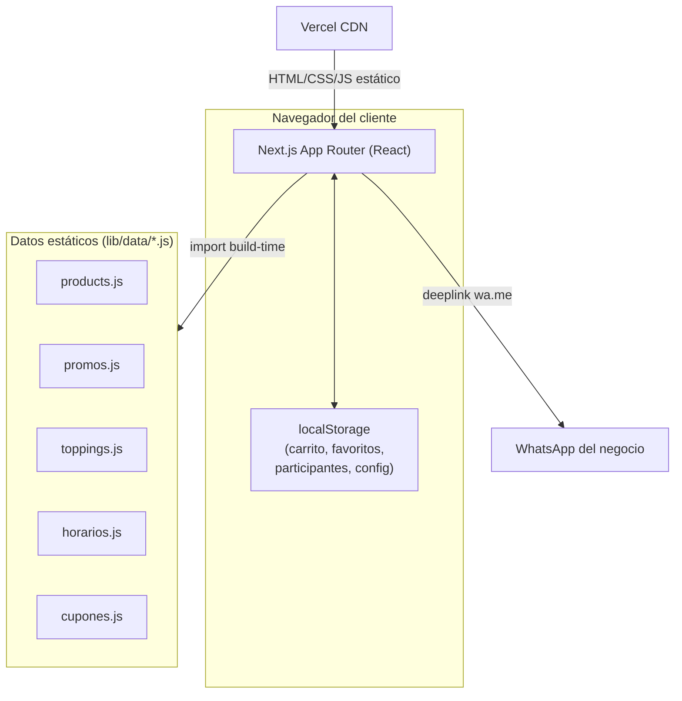
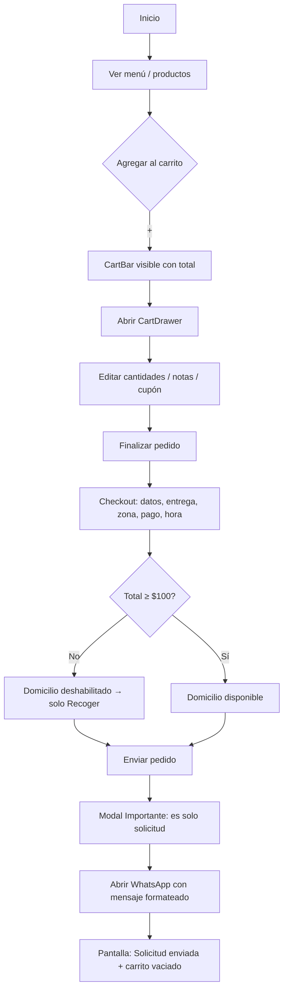
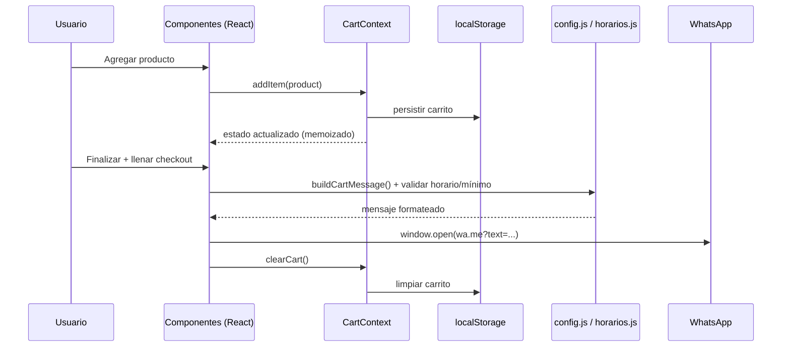
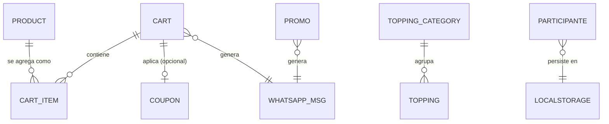
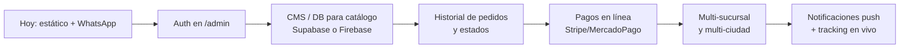

# ARCHITECTURE.md

> **Fuente única de verdad** del proyecto **Toppifresa**.
> Última actualización: 2026-07-17 · Commit de referencia: `f1d4aec`.
> Mantén este documento sincronizado con cada cambio estructural.

---

## 1. Información general del proyecto

| Campo | Valor |
|-------|-------|
| Nombre | Toppifresa |
| Tipo | PWA (Progressive Web App) de menú digital + pedidos |
| Negocio | Fresas con crema y toppings en Acámbaro, Guanajuato, México |
| Dirección | Plaza Alcasa (Cinepolis), Local #1 |
| Horario | Sábado y Domingo, 5:00 PM – 10:00 PM |
| Canal de pedido | WhatsApp (deeplink `wa.me`) — **no** hay pasarela de pago |
| WhatsApp negocio | `524439425620` |
| Repositorio | github.com/ldmh93/toppifresa (rama `main`) |
| Hosting | Vercel — proyecto `toppifresa` (team `luigis`) |
| URL producción | https://toppifresa.vercel.app |
| Desarrollador | Luis D. Maldonado — WhatsApp `524171279042` |

---

## 2. Visión y objetivos

**Visión.** Ofrecer un menú digital tipo app de delivery (Rappi / Uber Eats) que convierta la vitrina en pedidos por WhatsApp, sin fricción y sin costo de infraestructura de servidor.

**Objetivos:**
1. Que un cliente entienda el menú y arme un pedido en menos de 3 segundos de comprensión.
2. Maximizar conversión: carrito multi-producto, recomendaciones, promos con ahorro visible.
3. Cero backend operativo: la app es 100 % estática y el pedido viaja por WhatsApp.
4. Instalable como PWA en el teléfono del cliente.
5. Que el negocio pueda operar solo fines de semana con reglas claras (mínimo de domicilio, zonas de envío, horarios).

**No-objetivos (deliberados hoy):**
- No hay cobro en línea ni carrito con checkout de pago real.
- No hay cuentas de usuario ni login del cliente.
- El "pedido" es una **solicitud**; la confirmación ocurre por WhatsApp humano.

---

## 3. Usuarios y roles

| Rol | Acceso | Capacidades |
|-----|--------|-------------|
| **Cliente** | Rutas públicas `(app)` | Ver menú, armar carrito, aplicar cupón, enviar solicitud por WhatsApp, participar en dinámicas, instalar PWA |
| **Administrador** | Rutas `/admin/*` | Ver dashboard, gestionar contenido (efímero, ver §11), ver/exportar participantes del sorteo, sortear ganador |
| **Desarrollador** | Repo + Vercel | Deploy, configuración |

> ⚠️ **El área `/admin` NO tiene autenticación.** Es accesible por URL. Ver §13.

---

## 4. Stack tecnológico

| Capa | Tecnología | Versión | Notas |
|------|-----------|---------|-------|
| Framework | Next.js (App Router) | 14.2.5 | Compilador SWC (sin Babel custom) |
| UI | React | 18 | Componentes funcionales + hooks |
| Lenguaje | JavaScript (JSX) | ES2022 | **No TypeScript** (ver §19) |
| Estilos | TailwindCSS | 3.4.4 | + variables CSS en `globals.css` |
| Animación | Framer Motion | 11 | Transiciones, drawer, microinteracciones |
| Iconos | lucide-react | 0.395 | Set único de iconografía |
| Utilidades | clsx | 2.1 | Composición de clases |
| Deploy | Vercel | — | Estático + CDN |
| Alias de import | `@/*` → raíz | — | Definido en `jsconfig.json` |

**Dependencias eliminadas** (eran código muerto): `firebase`, `firebase-admin`, `@ducanh2912/next-pwa`.

---

## 5. Arquitectura general

Aplicación **frontend-only, estática**. No hay servidor de aplicación, base de datos ni API propia. Todo el estado del cliente vive en el navegador (`localStorage`). El pedido se materializa como un mensaje de WhatsApp.



**Consecuencia arquitectónica clave:** cualquier "gestión" desde `/admin` que no escriba a `localStorage` **no persiste** (los datos de menú/promos/toppings viven en archivos `.js` que solo cambian con un nuevo deploy). Ver §11 y §19.

---

## 6. Estructura de carpetas

```
toppifresa/
├── app/
│   ├── (app)/                  # Grupo de rutas públicas (cliente)
│   │   ├── layout.jsx          # Envuelve con CartProvider + navegación + footer
│   │   ├── page.jsx            # Inicio (hero, menú, toppings, promos, dinámica)
│   │   ├── productos/page.jsx  # Catálogo con filtros
│   │   ├── promos/page.jsx     # Promociones + T&C
│   │   ├── toppings/page.jsx   # Catálogo de toppings (máx. 2 por producto)
│   │   ├── dinamicas/page.jsx  # Sorteo + formulario de participación
│   │   └── ubicacion/page.jsx  # Mapa, dirección, horarios, redes
│   ├── admin/                  # Panel interno (SIN auth)
│   │   ├── layout.jsx
│   │   ├── page.jsx            # Dashboard
│   │   ├── productos/page.jsx  # CRUD efímero (solo estado en memoria)
│   │   ├── promos/page.jsx
│   │   ├── toppings/page.jsx
│   │   ├── dinamicas/page.jsx  # Participantes desde localStorage + export CSV + sorteo
│   │   └── config/page.jsx     # Config editable (persiste en localStorage)
│   ├── layout.jsx              # Root: metadata, SEO, JSON-LD, PWA meta
│   ├── error.jsx               # Error boundary global
│   ├── not-found.jsx           # 404 de marca
│   ├── sitemap.js              # Sitemap dinámico
│   ├── robots.js               # Robots (bloquea /admin)
│   └── manifest.json           # Manifiesto PWA
├── components/
│   ├── cart/                   # CartBar, CartDrawer, CartDrawerLazy
│   ├── coupons/CouponForm.jsx  # Registro de dinámica (guarda en localStorage)
│   ├── home/                   # HeroApp, MenuSection, MenuCard (+ 2 sin uso*)
│   ├── layout/                 # BottomTabs, FloatingWhatsApp, DevCredit
│   ├── products/               # ProductGrid, ProductCard
│   ├── promos/PromoCarousel.jsx
│   └── ui/                     # Badge, Button, Card (design system base)
├── lib/
│   ├── cart/
│   │   ├── CartContext.jsx     # Estado global del carrito (Context + localStorage)
│   │   └── config.js           # Reglas de negocio + generador de mensaje WhatsApp
│   ├── data/                   # products, promos, toppings, horarios, cupones
│   └── utils/                  # whatsapp, participantes, formatDate
├── public/
│   ├── icons/                  # Iconos PWA 72–512 px + apple-touch 180
│   └── toppi-logo.svg          # Logo oficial (hero)
├── styles/globals.css          # Variables CSS, utilidades, a11y, reduced-motion
├── tailwind.config.js          # Paleta, sombras, radios, keyframes
├── next.config.js
└── jsconfig.json               # Alias @/*
```

\* `components/home/FeaturedProducts.jsx` y `components/home/StorySlider.jsx` **no se importan en ningún lado** (código muerto candidato a eliminar — ver §18).

---

## 7. Descripción de módulos

| Módulo | Ubicación | Responsabilidad |
|--------|-----------|-----------------|
| **Carrito (estado)** | `lib/cart/CartContext.jsx` | Ítems, cantidades, notas, favoritos, cupón, apertura del drawer. Persiste en `localStorage`. Valores memoizados. |
| **Reglas de negocio** | `lib/cart/config.js` | Mínimo domicilio ($100), envío Zona Centro ($25), nota legal de solicitud, `buildCartMessage()`. |
| **Horarios** | `lib/data/horarios.js` | Horario semanal editable, `estaAbierto()`, `horariosDisponibles()`, mensaje de cierre. Única fuente de horario. |
| **Datos de catálogo** | `lib/data/{products,promos,toppings,cupones}.js` | Contenido estático del menú y ofertas. |
| **WhatsApp** | `lib/utils/whatsapp.js` | Construcción y apertura de deeplinks `wa.me`. |
| **Participantes** | `lib/utils/participantes.js` | Guarda/lee/exporta (CSV) registros del sorteo en `localStorage`. |
| **UI Kit** | `components/ui/` | `Badge`, `Button`, `Card` reutilizables. |
| **Navegación** | `components/layout/` | Tabs inferiores, FAB de WhatsApp, crédito del desarrollador. |

---

## 8. Componentes principales

| Componente | Tipo | Rol |
|-----------|------|-----|
| `CartProvider` | Client | Provee el contexto del carrito a toda el área pública. |
| `CartBar` | Client | Barra flotante con contador y total; abre el drawer. |
| `CartDrawer` | Client | Hoja inferior de 3 pasos: **carrito → checkout → enviado**, con modal de confirmación. Cargado vía `CartDrawerLazy` (dynamic import, `ssr:false`). |
| `MenuCard` | Client | Tarjeta del inicio: cantidad, nota, agregar al carrito, favorito. |
| `ProductCard` | Client | Tarjeta del catálogo: agregar al carrito, favorito, toppings. |
| `ProductGrid` | Client | Filtros por categoría + grid. |
| `PromoCarousel` | Client | Carrusel de promos con badge de ahorro y dots que siguen el scroll. |
| `HeroApp` | Client | Encabezado del inicio con logo animado y acceso a promos. |
| `CouponForm` | Client | Formulario de dinámica; escribe participante en `localStorage`. |
| `BottomTabs` / `FloatingWhatsApp` | Client | Navegación persistente y chat rápido. |

**Regla de renderizado:** las páginas (`page.jsx`) son Server Components por defecto; todo lo interactivo se aísla en componentes `'use client'`.

---

## 9. Flujo de usuario



**Reglas embebidas en el flujo:**
- Domicilio solo si total ≥ **$100**.
- Envío: **Zona Centro $25**; fuera de zona → "se cotiza según ubicación".
- Hora deseada: selector con **solo horarios abiertos**; si está cerrado, aviso de atención en el siguiente horario.
- El mensaje siempre incluye la nota de que el pedido **no queda confirmado** hasta respuesta del negocio.

---

## 10. Flujo de datos



**Claves de `localStorage`:**

| Clave | Contenido | Escrita por |
|-------|-----------|-------------|
| `toppifresa_cart_v1` | `{ items, coupon }` | `CartContext` |
| `toppifresa_favs_v1` | array de IDs favoritos | `CartContext` |
| `toppifresa_participantes` | array de registros del sorteo | `lib/utils/participantes` |
| Config admin | configuración editable | `app/admin/config` |

> **Limitación:** `localStorage` es por dispositivo/navegador. Los participantes solo son visibles en el aparato donde se llenó el formulario.

---

## 11. Modelo de entidades

No hay base de datos. Las "entidades" son objetos JS estáticos. Estructuras vigentes:

**Product** (`lib/data/products.js`)
```js
{ id, name, tagline, description, emoji,
  colors: { from, to, text }, tag, popular, isNew,
  toppings: string[], price, imageUrl? }
```

**Promo** (`lib/data/promos.js`)
```js
{ id, title, subtitle, description, tag, urgency, cta,
  emoji, colors: { from, to, accent }, whatsappMsg,
  savings?, expiresAt, active }
```

**ToppingCategory** (`lib/data/toppings.js`)
```js
{ id, name, emoji, color, items: [{ id, name, emoji }] }
```

**CartItem** (runtime)
```js
{ id, name, emoji, price, colors, note, qty }
```

**Participante** (`localStorage`)
```js
{ nombre, telefono, fecha /* ISO */ }
```

**Cupón** (`lib/data/cupones.js`)
```js
{ code, type: 'percent' | 'amount', value }
```

**Horario** (`lib/data/horarios.js`)
```js
HORARIO_SEMANAL = { [díaSemana 0-6]: { abre: hora24, cierra: hora24 } }
```



---

## 12. APIs e integraciones

| Integración | Tipo | Estado |
|-------------|------|--------|
| **WhatsApp** | Deeplink `wa.me?text=` | ✅ Activo — canal principal de pedido/contacto |
| **Vercel** | Hosting/CDN + deploy en push a `main` | ✅ Activo |
| **Google Maps** | `<iframe>` embed en Ubicación | ⚠️ Embed genérico de Acámbaro (falta URL exacta de Plaza Alcasa) |
| **Instagram** | Enlace externo | ✅ Enlace (`@toppifresa`) |
| **API interna** | — | ❌ Eliminada (`/api/cupones` y Firebase borrados) |

No hay APIs REST/servidor propias. No hay claves secretas en el cliente.

---

## 13. Seguridad

| Aspecto | Estado | Nota / riesgo |
|---------|--------|---------------|
| `/admin` sin autenticación | ❌ **Riesgo abierto** | Cualquiera con la URL entra. `robots.txt` lo desindexa, pero no lo protege. Ver §18. |
| Variables de entorno | ✅ | Solo `NEXT_PUBLIC_WHATSAPP_NUMBER` (público por diseño). `.env.local` en `.gitignore`. |
| XSS | ✅ Bajo | React escapa por defecto; único `dangerouslySetInnerHTML` es el JSON-LD (contenido controlado). |
| CSRF | N/A | No hay endpoints mutables en servidor. |
| Datos sensibles | ✅ | No se recopilan pagos ni credenciales. Teléfonos del sorteo viven en el dispositivo. |
| Sanitización de inputs | ⚠️ Parcial | El teléfono se limpia a 10 dígitos; el resto va como texto plano al mensaje de WhatsApp (sin ejecución). |
| Rate limiting | N/A | Sin servidor. |

---

## 14. Reglas de desarrollo

1. **Una sola fuente por dato de negocio.** Horarios → `lib/data/horarios.js`; reglas de compra → `lib/cart/config.js`; catálogo → `lib/data/*`. No duplicar valores en componentes.
2. **Server Components por defecto.** Añade `'use client'` solo cuando haya estado, efectos o eventos.
3. **Persistencia siempre por `localStorage`** con guardas `typeof window !== 'undefined'`.
4. **El pedido es una solicitud.** Nunca prometer confirmación automática en textos ni mensajes.
5. **No introducir backend sin actualizar este documento** (§19 lista la decisión pendiente).
6. **Verificar build antes de commit:** `npx next build` en limpio; nunca correr `build` con el `dev` activo (corrompe `.next`).
7. **Deploy = push a `main`** (Vercel despliega automático). Commits en español, con `Co-Authored-By`.
8. **Mantener identidad de marca:** paleta rosa (`#D63864`), radios grandes, microanimaciones sobrias.

---

## 15. Convenciones de código

| Convención | Regla |
|-----------|-------|
| Componentes | `PascalCase.jsx`, export default. |
| Utilidades/datos | `camelCase.js`. |
| Imports | Alias `@/` para rutas absolutas desde la raíz. |
| Estilos | Tailwind first; tokens compartidos vía clases (`card-base`, `tap-scale`) y variables CSS. |
| Colores | Desde la paleta de `tailwind.config.js` (`primary`, `app`). No hex sueltos salvo gradientes de producto/promo. |
| Iconos | Solo `lucide-react`. |
| Accesibilidad | `aria-label` en botones de solo icono; foco visible; targets ≥ 32 px. |
| Texto | Español (`es-MX`). |
| Animación | Framer Motion; respetar `prefers-reduced-motion` (ya global en CSS). |

---

## 16. Estrategia de escalabilidad

**Preparado para crecer con bajo costo:**
- Catálogo dirigido por datos: agregar productos/promos/toppings = editar un array.
- Reglas y horarios centralizados: cambio de horario/zona sin tocar componentes.
- Estructura por dominios (`cart`, `data`, `layout`, `products`, `promos`).

**Rutas de evolución recomendadas (en orden de valor):**



| Necesidad futura | Habilitador técnico |
|------------------|---------------------|
| Editar menú sin deploy | Base de datos + panel admin real (hoy el admin es efímero) |
| Varias sucursales | Modelo `branch` + selector de sucursal + reglas por zona |
| Programa de recompensas / cupones dinámicos | Cupones en DB (hoy `cupones.js` es estático) |
| Historial y seguimiento | Persistencia server + estados de pedido |
| Métodos de pago | Pasarela + backend para webhooks |
| TypeScript | Migración incremental (`.jsx` → `.tsx`) |

---

## 17. Estado actual del proyecto

**✅ Implementado y en producción:**
- Menú digital (8 productos) con filtros y personalización.
- Carrito completo estilo delivery: multi-producto, notas, favoritos, cupones, persistencia, recomendaciones, barra de progreso a domicilio.
- Checkout con reglas (mínimo $100, zonas de envío, selector de horario real, forma de pago, modal de confirmación) → mensaje formateado a WhatsApp.
- Promos con ahorro visible; dinámica/sorteo con registro local y exportación CSV.
- PWA instalable (manifiesto + 9 iconos).
- SEO (sitemap, robots, JSON-LD de negocio local, OG/Twitter).
- Accesibilidad base, manejo de errores (404 + error boundary), footer con crédito discreto.
- 100 % estático; dependencias muertas eliminadas.

**⚠️ Parcial / con deuda:**
- `/admin` sin auth y con edición **efímera** (no persiste catálogo).
- Embed de Google Maps genérico (falta ubicación exacta).
- Firebase configurable en `.env` pero **no cableado** (el código fue removido).
- Componentes muertos: `FeaturedProducts.jsx`, `StorySlider.jsx`.

---

## 18. Próximos pasos

**Prioridad alta**
1. **Proteger `/admin`** (contraseña/clave o `middleware` con verificación) — hoy es acceso abierto.
2. Eliminar código muerto: `FeaturedProducts.jsx`, `StorySlider.jsx`, y revisar `ui/Card.jsx` si no se usa.
3. Reemplazar el embed de Maps por la URL/coordenadas reales de Plaza Alcasa.

**Prioridad media**
4. Persistencia real del catálogo (Supabase/Firebase) para que el admin no sea efímero.
5. Historial de pedidos (aunque sea del lado negocio).
6. Validación en tiempo real más rica en formularios (checkout y dinámica).

**Prioridad baja / futuro**
7. Migración incremental a TypeScript.
8. Pagos en línea, multi-sucursal, notificaciones push, tracking.

---

## 19. Pendientes por definir

> Información **no disponible** en el código actual. No inventar; confirmar con el negocio/dueño.

| Tema | Pregunta abierta |
|------|------------------|
| Backend / base de datos | ¿Se adoptará DB (Supabase/Firebase) o se mantiene 100 % estático? Define todo el rumbo. |
| Auth de admin | ¿Qué mecanismo? (clave simple, Vercel password, proveedor de auth). |
| Precio del combo de 3 Toppifresa | Se asumió **$185** (3×$55 + $20). Falta confirmación oficial. |
| Cupones | ¿Habrá cupones activos? ¿Cuáles, con qué vigencia? (`cupones.js` está vacío). |
| Zonas de envío | Definición exacta de "Zona Centro" vs "fuera"; tarifas fuera de centro. |
| Ubicación en Maps | URL/coordenadas exactas de Plaza Alcasa, Local #1. |
| Facebook Pixel / analítica | ¿Se instalará? (se preparó y luego se revirtió; no está activo). |
| Recolección central de participantes | ¿WhatsApp automático, Google Sheet o DB? Hoy solo `localStorage` por dispositivo. |
| Dominio propio | ¿Se usará un dominio distinto a `toppifresa.vercel.app`? (afecta `metadataBase`, sitemap, JSON-LD). |
| Redes sociales | Confirmar handle real de Instagram y si hay más redes. |
```
