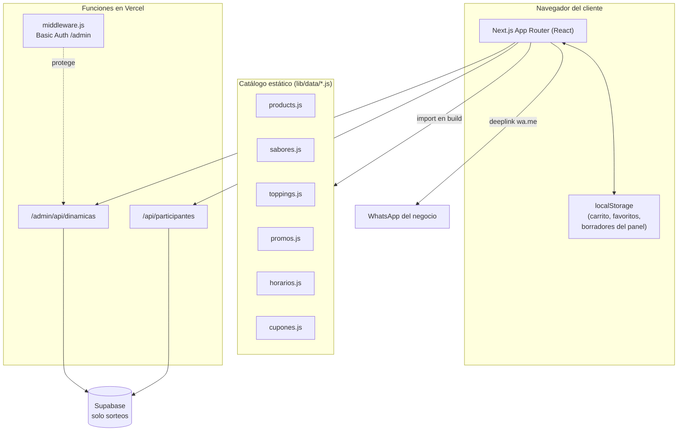
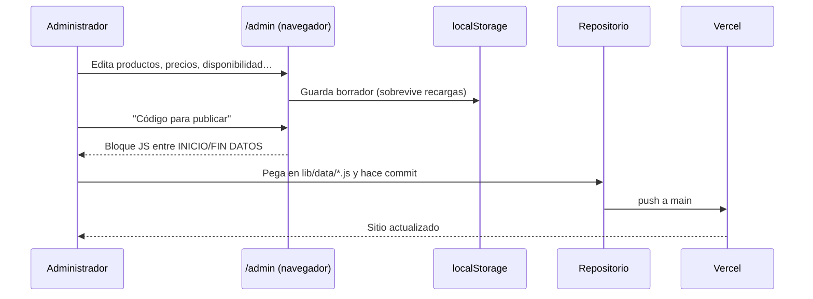
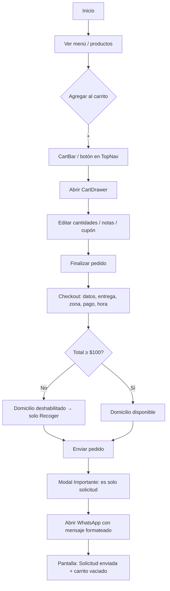

# ARCHITECTURE.md

> **Fuente única de verdad** del proyecto **Toppifresa**.
> Última actualización: 2026-09-10 · Versión 2.0 — rebranding, mobile-first con escritorio real, panel honesto.
> Mantén este documento sincronizado con cada cambio estructural.

---

## 1. Información general del proyecto

| Campo | Valor |
|-------|-------|
| Nombre | Toppifresa |
| Eslogan oficial | *Tu dosis de felicidad diaria* |
| Tipo | PWA (Progressive Web App) de menú digital + pedidos |
| Negocio | Fresas con crema y toppings en Acámbaro, Guanajuato, México |
| Dirección | Plaza Alcasa (Cinepolis), Local #1 |
| Horario | Sábado y Domingo, 5:00 PM – 10:00 PM |
| Canal de pedido | WhatsApp (deeplink `wa.me`) — **no** hay pasarela de pago |
| WhatsApp negocio | `524439425620` |
| Repositorio | github.com/ldmh93/toppifresa (rama `main`) |
| Hosting | Vercel — proyecto `toppifresa` (team `luigis`) |
| URL producción | https://toppifresa.vercel.app |
| Desarrollador | Luis D. Maldonado — WhatsApp `524171279042` |

---

## 2. Visión y objetivos

**Visión.** Ofrecer un menú digital tipo app de delivery (Rappi / Uber Eats) que convierta la vitrina en pedidos por WhatsApp, sin fricción y sin costo de infraestructura de servidor.

**Objetivos:**
1. Que un cliente entienda el menú y arme un pedido en menos de 3 segundos de comprensión.
2. Maximizar conversión: carrito multi-producto, recomendaciones, promos con ahorro visible.
3. Costo de infraestructura casi nulo: el sitio es estático salvo el sorteo.
4. Instalable como PWA en el teléfono del cliente.
5. Que el negocio pueda operar solo fines de semana con reglas claras (mínimo de domicilio, zonas de envío, horarios).

**No-objetivos (deliberados hoy):**
- No hay cobro en línea ni checkout de pago real.
- No hay cuentas de usuario ni login del cliente.
- El "pedido" es una **solicitud**; la confirmación ocurre por WhatsApp humano.
- **No hay base de datos para el catálogo.** Decisión tomada explícitamente: el menú vive en archivos de código. Ver §11 y §20.

---

## 3. Usuarios y roles

| Rol | Acceso | Capacidades |
|-----|--------|-------------|
| **Cliente** | Rutas públicas `(app)` | Ver menú, armar carrito, aplicar cupón, enviar solicitud por WhatsApp, participar en dinámicas, instalar PWA |
| **Administrador** | Rutas `/admin/*` (Basic Auth) | Editar catálogo con interfaz y generar el código para publicarlo; ver/exportar participantes del sorteo; sortear ganador |
| **Desarrollador** | Repo + Vercel | Pegar los bloques generados, deploy, configuración |

> ✅ `/admin` está protegido con **HTTP Basic Auth** en `middleware.js`. Sin `ADMIN_PASSWORD` definida el panel responde 503 (seguro por defecto).

---

## 4. Stack tecnológico

| Capa | Tecnología | Versión | Notas |
|------|-----------|---------|-------|
| Framework | Next.js (App Router) | 14.2.35 | Compilador SWC (sin Babel custom) |
| UI | React | 18 | Componentes funcionales + hooks |
| Lenguaje | JavaScript (JSX) | ES2022 | **No TypeScript** (ver §19) |
| Estilos | TailwindCSS | 3.4 | + variables CSS en `globals.css` |
| Tipografía | `next/font/google` | — | Fraunces (display) + Nunito (texto). Auto-hospedadas: cero peticiones a Google en runtime |
| Animación | Framer Motion | 11 | Transiciones, drawer, microinteracciones |
| Iconos | lucide-react | 0.395 | Set único de iconografía |
| Utilidades | clsx | 2.1 | Composición de clases |
| Base de datos | Supabase (Postgres) | js 2.111 | **Solo sorteos.** El catálogo NO usa base de datos |
| Deploy | Vercel | — | Estático + CDN + una función de borde |
| Alias de import | `@/*` → raíz | — | Definido en `jsconfig.json` |

**Solo desarrollo (`devDependencies`):** `sharp` (genera los iconos PWA), `puppeteer-core` (pruebas E2E y capturas, usa el Chrome del sistema — no descarga navegadores), `eslint` + `eslint-config-next`.

**Dependencias eliminadas** (eran código muerto): `firebase`, `firebase-admin`, `@ducanh2912/next-pwa`.

---

## 5. Identidad de marca

El branding oficial vive en `Branding toppifresa/` (los binarios pesados están en `.gitignore`; los SVG que usa la app están optimizados en `public/brand/`).

### Paleta

Los colores **no son inventados**: salen de los SVG de la marca.

| Token | Hex | Contraste sobre blanco | Uso |
|-------|-----|------------------------|-----|
| `primary` / `primary-700` | `#9C0B0A` | **8.52:1** ✅ | Color del logotipo. Apto para texto pequeño |
| `primary-900` | `#6B0306` | 12.80:1 ✅ | Fondos oscuros, degradados |
| `primary-500` | `#C3201C` | 6.09:1 ✅ | Texto secundario, acentos |
| `rose` | `#E2787D` | 2.91:1 ❌ | **Solo decorativo** |
| `pink` | `#FF7BAC` | 2.42:1 ❌ | **Solo decorativo** |
| `gold` | `#F8B520` | 1.89:1 ❌ | **Solo decorativo** |
| `leaf` | `#2A843F` | 4.70:1 ✅ | Hojas, estados "disponible" |

> ⚠️ `rose`, `pink` y `gold` nunca deben usarse para texto sobre fondo claro.
> El cambio de la paleta anterior (`#D63864`, 4.56:1) a `#9C0B0A` (8.52:1) **casi duplicó el contraste**: el rebranding también fue una mejora de accesibilidad.

### Logotipos (`public/brand/`)

| Archivo | Qué es | Dónde se usa |
|---------|--------|--------------|
| `logo-full.svg` | Fresas ilustradas + wordmark + eslogan | Portada (hero) |
| `logo-wordmark.svg` | Wordmark rojo horizontal | Barra superior de escritorio |
| `logo-wordmark-light.svg` | Wordmark rosa | Reserva, para fondos oscuros |
| `logo-stack.svg` / `logo-compact.svg` | Versiones apiladas | Reserva, espacios estrechos |
| `logo-mark.svg` | Monograma "ToF" | Origen de los iconos PWA y el favicon |
| `pattern-strawberries.svg` | Patrón de fresas | Fondo del hero |
| `pattern-soft.svg` | Patrón rosa suave | Fondo lateral en escritorio |

Los iconos PWA se regeneran con `npm run iconos` (nunca se editan a mano).

### Tipografía

El branding original usa **Mora** (serif) y **Bubbleboddy Neue** (redondeada), ambas de licencia comercial y ausentes de la carpeta. Se sustituyen por las libres más cercanas:

- **Fraunces** → titulares (`font-display`)
- **Nunito** → texto e interfaz (`font-sans`)

El logotipo conserva la tipografía real porque va como SVG.

---

## 6. Arquitectura general

Aplicación **frontend-first**: páginas estáticas servidas por CDN, una función de borde (`middleware.js`) que protege `/admin`, y dos route handlers que hablan con Supabase **solo para el sorteo**. El catálogo se resuelve en build. El pedido se materializa como un mensaje de WhatsApp.


```mermaid
graph TD
    subgraph Cliente["Navegador del cliente"]
        UI["Next.js App Router (React)"]
        LS["localStorage<br/>(carrito, favoritos,<br/>borradores del panel)"]
        UI <--> LS
    end

    subgraph Datos["Catálogo estático (lib/data/*.js)"]
        P["products.js"]
        S["sabores.js"]
        T["toppings.js"]
        PR["promos.js"]
        H["horarios.js"]
        C["cupones.js"]
    end

    subgraph Servidor["Funciones en Vercel"]
        MW["middleware.js<br/>Basic Auth /admin"]
        API1["/api/participantes"]
        API2["/admin/api/dinamicas"]
    end

    SB[("Supabase<br/>solo sorteos")]

    UI -->|import en build| Datos
    UI --> API1 --> SB
    UI --> API2 --> SB
    MW -.protege.-> API2
    UI -->|"deeplink wa.me"| WA["WhatsApp del negocio"]
```

**Consecuencia arquitectónica clave:** el panel `/admin` **no escribe en ningún lado**. Es un editor que guarda borradores en `localStorage` y genera el bloque de código que hay que pegar en `lib/data/*.js`. Ver §12.

---

## 7. Estrategia responsive

Mobile-first de verdad: el teléfono manda y el escritorio **añade**, no al revés.

| Ancho | Contenido | Navegación | Menú | Carrito |
|-------|-----------|------------|------|---------|
| < 768 px | 100 % | Tabs inferiores (5) | 1 columna | Barra flotante inferior |
| 768–1023 px | 720 px | Tabs inferiores | 1 columna | Barra flotante inferior |
| ≥ 1024 px | 1100 px | **Barra superior** (7 enlaces) | 2–3 columnas | Botón en la barra superior |
| ≥ 1440 px | 1280 px | Barra superior | 3 columnas | Botón en la barra superior |

El ancho se controla con la variable CSS `--content-max` en `globals.css`; los componentes fijos (tabs, FAB de WhatsApp) la leen para alinearse solos. A partir de 768 px aparece el patrón de fresas de la marca a los lados en vez de un vacío.

`--bottom-nav-height` pasa a `0px` en escritorio, y de ahí sale automáticamente la posición del FAB y el relleno inferior del contenido.

---

## 8. Estructura de carpetas

```
toppifresa/
├── app/
│   ├── (app)/                  # Grupo de rutas públicas (cliente)
│   │   ├── layout.jsx          # CartProvider + TopNav + tabs + footer
│   │   ├── page.jsx            # Inicio (hero, menú, toppings, promos, dinámica)
│   │   ├── productos/page.jsx  # Catálogo con filtros
│   │   ├── promos/page.jsx     # Promociones + T&C
│   │   ├── toppings/page.jsx   # Catálogo de toppings (máx. 2 por producto)
│   │   ├── dinamicas/page.jsx  # Sorteo + formulario (ISR, revalidate 60 s)
│   │   └── ubicacion/page.jsx  # Mapa, dirección, horarios, redes
│   ├── admin/                  # Panel interno (Basic Auth)
│   │   ├── layout.jsx
│   │   ├── page.jsx            # Dashboard con métricas reales
│   │   ├── productos/page.jsx  # CRUD + disponibilidad + orden + sabores
│   │   ├── categorias/page.jsx # CRUD de categorías del menú
│   │   ├── sabores/page.jsx    # CRUD de sabores con precio adicional
│   │   ├── toppings/page.jsx   # CRUD de categorías e ingredientes
│   │   ├── promos/page.jsx     # CRUD de promos
│   │   ├── dinamicas/page.jsx  # Participantes desde Supabase + CSV + sorteo
│   │   ├── config/page.jsx     # Configuración real, SOLO LECTURA
│   │   └── api/dinamicas/      # Route handler del sorteo (tras el middleware)
│   ├── api/participantes/      # Registro público al sorteo
│   ├── layout.jsx              # Root: fuentes, metadata, SEO, JSON-LD, PWA
│   ├── error.jsx               # Error boundary global
│   ├── not-found.jsx           # 404 de marca
│   ├── sitemap.js · robots.js · manifest.json
├── components/
│   ├── admin/BarraPublicar.jsx # Genera el código para publicar
│   ├── cart/                   # CartBar, CartDrawer, CartDrawerLazy
│   ├── coupons/CouponForm.jsx  # Registro de la dinámica
│   ├── home/                   # HeroApp, MenuSection, MenuCard
│   ├── layout/                 # TopNav, BottomTabs, FloatingWhatsApp, DevCredit
│   ├── products/               # ProductGrid, ProductCard
│   ├── promos/PromoCarousel.jsx
│   └── ui/                     # Badge, Button
├── lib/
│   ├── admin/
│   │   ├── borrador.js         # useBorrador: estado que sobrevive recargas
│   │   └── exportar.js         # Serializa datos a JavaScript válido
│   ├── cart/
│   │   ├── CartContext.jsx     # Estado global del carrito
│   │   └── config.js           # Reglas de negocio + buildCartMessage()
│   ├── data/                   # products, categorias, sabores, toppings, promos, horarios, cupones
│   ├── supabase/server.js      # Cliente servidor + timeout + detección de caída
│   └── utils/                  # whatsapp, participantes, formatDate
├── public/
│   ├── brand/                  # Logotipos y patrones oficiales (SVG optimizados)
│   ├── icons/                  # Iconos PWA 72–512 px, generados del monograma
│   └── favicon.png
├── scripts/
│   ├── generar-iconos.mjs      # npm run iconos
│   ├── probar-exportacion.mjs  # npm run test:datos
│   ├── pruebas-e2e.mjs         # npm run test:e2e
│   ├── capturas.mjs            # npm run capturas
│   └── diagnostico-supabase.mjs
├── supabase/schema.sql         # Esquema de sorteos y participantes
├── middleware.js               # Basic Auth para /admin
├── styles/globals.css          # Tokens, responsive, a11y, reduced-motion
├── tailwind.config.js          # Paleta de marca, sombras, tipografías
└── next.config.js              # Cabeceras de seguridad, imágenes, caché
```

---

## 9. Descripción de módulos

| Módulo | Ubicación | Responsabilidad |
|--------|-----------|-----------------|
| **Carrito (estado)** | `lib/cart/CartContext.jsx` | Ítems, cantidades, notas, favoritos, cupón, apertura del drawer. Persiste en `localStorage`. Valores memoizados. |
| **Reglas de negocio** | `lib/cart/config.js` | Mínimo domicilio ($100), envío Zona Centro ($30), nota legal, `buildCartMessage()`. |
| **Horarios** | `lib/data/horarios.js` | Horario semanal, `estaAbierto()`, `horariosDisponibles()`. Única fuente de horario. |
| **Catálogo** | `lib/data/{products,sabores,toppings,promos,cupones}.js` | Contenido del menú. Cada archivo expone helpers "públicos" que filtran lo inactivo y ordenan. |
| **Borradores del panel** | `lib/admin/borrador.js` | `useBorrador()`: estado que sobrevive a recargas vía `localStorage`, con descarte. |
| **Generador de código** | `lib/admin/exportar.js` | Serializa objetos JS a código válido y legible. Probado con round-trip (`npm run test:datos`). |
| **Supabase** | `lib/supabase/server.js` | Cliente de servidor, `conLimite()` (techo de 8 s) y `esErrorDeConexion()`. |
| **WhatsApp** | `lib/utils/whatsapp.js` | Construcción y apertura de deeplinks `wa.me`. |
| **Participantes** | `lib/utils/participantes.js` | Exporta a CSV los registros que llegan de Supabase. |

---

## 10. Componentes principales

| Componente | Tipo | Rol |
|-----------|------|-----|
| `CartProvider` | Client | Provee el contexto del carrito a toda el área pública. |
| `TopNav` | Client | **Escritorio (≥ lg).** Logo, 7 enlaces, carrito con total, CTA de WhatsApp. |
| `BottomTabs` | Client | **Móvil y tablet.** 5 pestañas. Se oculta en escritorio. |
| `CartBar` | Client | Barra flotante con contador y total. Se oculta en escritorio. |
| `CartDrawer` | Client | Hoja de 3 pasos: **carrito → checkout → enviado**. Carga diferida (`ssr:false`). |
| `HeroApp` | Client | Portada: logotipo oficial, patrón de marca y **estado abierto/cerrado en vivo**. |
| `MenuCard` / `ProductCard` | Client | Tarjetas de producto. Respetan `estado` (agotado se ve en gris y no se puede pedir). |
| `ProductGrid` | Client | Filtros + rejilla responsive. Lo agotado va al final. Los filtros son una curación de marketing (combinan `tag`, `popular` e `isNew`), no un espejo 1:1 de las categorías. |
| `BarraPublicar` | Client | Explica dónde está el borrador y genera el bloque a pegar. |
| `CouponForm` | Client | Formulario de la dinámica; escribe en Supabase vía `/api/participantes`. |

**Regla de renderizado:** las páginas (`page.jsx`) son Server Components por defecto; todo lo interactivo se aísla en componentes `'use client'`.

---

## 11. Modelo de entidades

No hay base de datos para el catálogo. Las entidades son objetos JS en `lib/data/`, delimitados por marcas `INICIO DATOS` / `FIN DATOS` que el panel usa como frontera de reemplazo.

**Product** (`lib/data/products.js`)
```js
{ id, name, tagline, description, emoji,
  colors: { from, to, text }, tag, popular, isNew,
  incluye: string[],        // ingredientes de fábrica (antes se llamaba `toppings`)
  price, imageUrl,
  estado: 'disponible' | 'agotado' | 'pausado',
  orden: number,
  sabores: string[] }       // IDs de sabores.js; vacío = se vende tal cual
```

**Categoria** (`lib/data/categorias.js`)
```js
{ id, emoji, activo, orden }   // el `id` es también el texto visible y lo que guarda product.tag
```

**Sabor** (`lib/data/sabores.js`)
```js
{ id, nombre, emoji, precioExtra, activo, orden }
```

**ToppingCategory** (`lib/data/toppings.js`)
```js
{ id, name, emoji, color, activo, orden,
  items: [{ id, name, emoji, precio, activo, orden }] }
```

**Promo** (`lib/data/promos.js`)
```js
{ id, title, subtitle, description, tag, urgency, cta, emoji,
  colors: { from, to, accent }, whatsappMsg, savings, expiresAt, active }
```

**CartItem** (runtime) · `{ id, name, emoji, price, colors, note, qty }`
**Cupón** · `{ code, type: 'percent' | 'amount', value }`

**Sorteo y Participante** viven en Supabase (`supabase/schema.sql`), con RLS activo y sin políticas: solo se llega con la llave secreta desde el servidor.

### Estados de disponibilidad

| Estado | En el menú público | Se puede pedir |
|--------|--------------------|----------------|
| `disponible` | Normal | Sí |
| `agotado` | En gris, marcado, al final de la lista | No |
| `pausado` | No aparece | No |

---

## 12. Cómo se publica un cambio de menú

El panel **no escribe en el sitio**. El flujo completo es:


```mermaid
sequenceDiagram
    participant A as Administrador
    participant P as /admin (navegador)
    participant LS as localStorage
    participant R as Repositorio
    participant V as Vercel

    A->>P: Edita productos, precios, disponibilidad…
    P->>LS: Guarda borrador (sobrevive recargas)
    A->>P: "Código para publicar"
    P-->>A: Bloque JS entre INICIO/FIN DATOS
    A->>R: Pega en lib/data/*.js y hace commit
    R->>V: push a main
    V-->>A: Sitio actualizado
```

Por qué así y no con base de datos: fue una decisión explícita del negocio para no añadir infraestructura ni costo. El panel anterior *aparentaba* guardar y perdía todo al recargar; ahora es honesto sobre dónde está cada cosa.

**Claves de `localStorage`:**

| Clave | Contenido | Escrita por |
|-------|-----------|-------------|
| `toppifresa_cart_v1` | `{ items, coupon }` | `CartContext` |
| `toppifresa_favs_v1` | Array de IDs favoritos | `CartContext` |
| `toppifresa_borrador_productos` | Borrador del catálogo | `useBorrador` |
| `toppifresa_borrador_categorias` | Borrador de categorías | `useBorrador` |
| `toppifresa_borrador_sabores` | Borrador de sabores | `useBorrador` |
| `toppifresa_borrador_toppings` | Borrador de toppings | `useBorrador` |
| `toppifresa_borrador_promos` | Borrador de promos | `useBorrador` |

---

## 13. Flujo de usuario


```mermaid
flowchart TD
    A[Inicio] --> B[Ver menú / productos]
    B --> C{Agregar al carrito}
    C -->|+| D[CartBar / botón en TopNav]
    D --> E[Abrir CartDrawer]
    E --> F[Editar cantidades / notas / cupón]
    F --> G[Finalizar pedido]
    G --> H[Checkout: datos, entrega, zona, pago, hora]
    H --> I{Total ≥ $100?}
    I -->|No| J[Domicilio deshabilitado → solo Recoger]
    I -->|Sí| K[Domicilio disponible]
    J --> L[Enviar pedido]
    K --> L
    L --> M[Modal Importante: es solo solicitud]
    M --> N[Abrir WhatsApp con mensaje formateado]
    N --> O[Pantalla: Solicitud enviada + carrito vaciado]
```

**Reglas embebidas:**
- Domicilio solo si total ≥ **$100**; si falta, la barra dice cuánto.
- Envío: **Zona Centro $30**; fuera de zona → "se cotiza según ubicación".
- Hora deseada: solo horarios abiertos reales.
- El mensaje siempre incluye que el pedido **no queda confirmado** hasta respuesta del negocio.
- Un producto `agotado` no se puede añadir ni se recomienda.

---

## 14. APIs e integraciones

| Integración | Tipo | Estado |
|-------------|------|--------|
| **WhatsApp** | Deeplink `wa.me?text=` | ✅ Canal principal de pedido |
| **Vercel** | Hosting/CDN + deploy en push a `main` | ✅ Activo |
| **Supabase** | Postgres, solo sorteos | ⚠️ Ver §21 — el proyecto no resuelve en DNS |
| **Google Analytics 4** | `NEXT_PUBLIC_GA_ID`, carga `afterInteractive` | ✅ Activo si la variable existe |
| **Google Maps** | `<iframe>` embed en Ubicación | ⚠️ Embed genérico (falta URL exacta) |
| **Instagram** | Enlace externo `@toppifresa` | ✅ |

### Resiliencia de Supabase

Cuando la base no responde, la app **degrada sin romperse**:

| Situación | Antes | Ahora |
|-----------|-------|-------|
| Página `/dinamicas` | 8 s de espera por visita | **36 ms** (ISR, `revalidate = 60`) |
| Registro al sorteo | 50 s → error genérico 500 | **8 s** → 503 con "escríbenos por WhatsApp" |
| Panel de clientes | 50 s → error genérico | **8 s** → 503 explicando que revise Supabase |

El techo de 8 s lo garantiza `conLimite()` en `lib/supabase/server.js`. Se implementó con `Promise.race` porque el `AbortSignal` del cliente de Supabase **no se aplica** en todos sus caminos internos dentro del servidor de Next (medido: seguía tardando ~30 s).

---

## 15. Seguridad

| Aspecto | Estado | Nota |
|---------|--------|------|
| `/admin` protegido | ✅ | Basic Auth en `middleware.js`. Sin `ADMIN_PASSWORD` → 503. Credenciales nunca en código. |
| Llave de Supabase | ✅ | `SUPABASE_SECRET_KEY` sin prefijo `NEXT_PUBLIC_`: nunca llega al navegador. RLS activo sin políticas. |
| Cabeceras de seguridad | ✅ | `X-Content-Type-Options`, `X-Frame-Options`, `Referrer-Policy`, `Permissions-Policy`. `X-Powered-By` desactivado. |
| Content-Security-Policy | ⚠️ Pendiente | Requiere nonces por petición con Next. Ver §19. |
| XSS | ✅ Bajo | React escapa por defecto; el único `dangerouslySetInnerHTML` es el JSON-LD (contenido controlado). |
| Validación de entrada | ✅ | Teléfono a 10 dígitos, nombre 2–80, precios numéricos. El esquema SQL repite las reglas con `CHECK`. |
| Datos sensibles | ✅ | No se recopilan pagos ni credenciales. |
| Rate limiting | ⚠️ No hay | `/api/participantes` es público. Ver §19. |

### Vulnerabilidades de dependencias

`npm audit` pasó de **10 a 5** aplicando solo arreglos sin ruptura. Las 5 restantes (1 crítica, 4 altas) provienen todas de la cadena de Next 14 y **solo se resuelven migrando a Next 16**, un cambio mayor que está fuera del alcance acordado.

Evaluadas una por una, ninguna es explotable en esta configuración:

- **Crítica — Next.js DoS vía Image Optimizer `remotePatterns`:** este proyecto tiene `remotePatterns: []` (vacío). Sin orígenes remotos permitidos no hay superficie de ataque. Además el aviso aplica a instalaciones self-hosted; aquí el optimizador lo gestiona Vercel.
- **Alta — `glob` command injection vía `-c/--cmd`:** afecta a la CLI de `glob`, que solo se usa en tiempo de desarrollo por ESLint. No se ejecuta en producción.
- **Altas — `postcss`, `@next/eslint-plugin-next`:** herramientas de build y lint, no llegan al navegador del cliente.

> Si en el futuro se añaden fotos de producto con `imageUrl` apuntando a un host externo, **hay que reevaluar la crítica de Next** antes de configurar `remotePatterns`.

---

## 16. Pruebas

| Comando | Qué hace |
|---------|----------|
| `npm test` | Lint + prueba del generador de código |
| `npm run test:datos` | Serializa el catálogo, lo reimporta y comprueba que no pierda datos. Incluye casos límite: apóstrofos (`Hershey's`), acentos, emoji, saltos de línea, barras invertidas |
| `npm run test:e2e` | **68 comprobaciones** con Chrome real sobre los dos flujos completos |
| `npm run capturas` | 33 capturas en móvil/tablet/escritorio, detectando errores de consola, fallos de red y desbordes horizontales |

`test:e2e` cubre: carga del menú, filtros, agregar al carrito, persistencia tras recarga, apertura del carrito, aviso del mínimo de domicilio, checkout, los 13 campos del mensaje de WhatsApp, rechazo de credenciales incorrectas en `/admin`, métricas reales del dashboard, marcado de agotado, supervivencia del borrador, y que el código generado refleje los cambios.

**Estado actual: 68 pasadas, 0 fallidas.**

---

## 17. Reglas de desarrollo

1. **Una sola fuente por dato de negocio.** Horarios → `lib/data/horarios.js`; reglas de compra → `lib/cart/config.js`; catálogo → `lib/data/*`. No duplicar valores en componentes.
2. **Server Components por defecto.** `'use client'` solo cuando haya estado, efectos o eventos.
3. **Persistencia siempre por `localStorage`** con guardas `typeof window !== 'undefined'` o dentro de `useEffect`.
4. **El pedido es una solicitud.** Nunca prometer confirmación automática.
5. **Nada de colores sueltos.** Usar los tokens de `tailwind.config.js`. Los únicos hex admitidos son los degradados por producto/promo en `lib/data/*`.
6. **`rose`, `pink` y `gold` no son para texto** sobre fondo claro (contraste < 3:1).
7. **Verificar antes de commit:** `npm test`, y `npx next build` en limpio. Nunca correr `build` con el `dev` activo (corrompe `.next`).
8. **Los iconos PWA no se editan a mano:** `npm run iconos`.
9. **No introducir backend sin actualizar este documento.**
10. **Deploy = push a `main`.** Commits en español, con `Co-Authored-By`.

---

## 18. Convenciones de código

| Convención | Regla |
|-----------|-------|
| Componentes | `PascalCase.jsx`, export default. |
| Utilidades/datos | `camelCase.js`. |
| Nombres nuevos | En español (`useBorrador`, `esVendible`, `conLimite`). El código antiguo en inglés se respeta donde está. |
| Imports | Alias `@/` para rutas absolutas desde la raíz. |
| Estilos | Tailwind first; tokens compartidos vía clases (`card-base`, `tap-scale`) y variables CSS. |
| Iconos | Solo `lucide-react`. |
| Accesibilidad | `aria-label` en botones de solo icono, `aria-pressed` en interruptores, `aria-current` en navegación, foco visible, targets ≥ 32 px, enlace "Saltar al contenido". |
| Texto | Español (`es-MX`). |
| Animación | Framer Motion; `prefers-reduced-motion` respetado globalmente en CSS. |

---

## 19. Estado actual del proyecto

**✅ Implementado:**
- Menú digital (8 productos) con filtros, personalización y estados de disponibilidad.
- Carrito completo estilo delivery: multi-producto, notas, favoritos, cupones, persistencia, recomendaciones, barra de progreso a domicilio.
- Checkout con reglas reales → mensaje formateado a WhatsApp.
- Identidad de marca oficial aplicada en toda la app, con la paleta, los logotipos y el eslogan reales.
- Mobile-first con **escritorio real**: barra superior, rejillas de 2–3 columnas, patrón de marca a los lados.
- Panel administrativo honesto: métricas reales, borradores que no se pierden, generación de código para publicar.
- Categorías del menú administrables: crear, renombrar (avisando cuántos productos afecta), ordenar, ocultar y eliminar.
- Sabores como entidad propia con precio adicional (modelo listo, aún sin usar en el menú).
- Toppings con precio, activación y orden.
- PWA instalable con iconos generados del monograma oficial.
- SEO (sitemap, robots, JSON-LD, OG/Twitter) y cabeceras de seguridad.
- 65 pruebas E2E automatizadas.

**⚠️ Parcial / con deuda:**
- **Supabase no responde** (ver §21). La app degrada bien, pero el sorteo no funciona.
- El catálogo requiere pegar código y publicar para cambiar (decisión consciente, no un defecto).
- Embed de Google Maps genérico.
- Sin Content-Security-Policy ni rate limiting.

---

## 20. Próximos pasos

**Prioridad alta**
1. **Restaurar o recrear el proyecto de Supabase** — sin esto la dinámica del sorteo está muerta (§21).
2. Reemplazar el embed de Maps por la URL/coordenadas reales de Plaza Alcasa.
3. Añadir fotos reales de producto (`imageUrl`) — el modelo ya lo soporta. Requiere configurar `remotePatterns` y reevaluar el aviso de seguridad de Next.

**Prioridad media**
4. Rate limiting en `/api/participantes`.
5. Content-Security-Policy con nonces.
6. Activar los sabores dentro de un producto si el negocio quiere venderlos así.
7. Evaluar la migración a Next 16 para cerrar las 5 vulnerabilidades restantes.

**Prioridad baja / futuro**
8. Migración incremental a TypeScript.
9. Pagos en línea, multi-sucursal, notificaciones push.

---

## 21. Incidencia abierta: Supabase

El host `gplxswhdozzgvanszgrj.supabase.co` **no existe en DNS** (NXDOMAIN confirmado contra 8.8.8.8 y 1.1.1.1). No es un problema de red local: `supabase.com` y `google.com` resuelven con normalidad.

Causa más probable: el proyecto del plan gratuito se **pausó automáticamente** tras varios días sin actividad. También pudo eliminarse, o el ref de `SUPABASE_URL` puede estar equivocado.

**Qué hacer:** entrar a [supabase.com/dashboard](https://supabase.com/dashboard). Si aparece como *Paused*, el botón **Restore project** lo revive en un par de minutos sin tocar código. Si hay que crear uno nuevo, aplicar `supabase/schema.sql` en el SQL Editor y actualizar `SUPABASE_URL` y `SUPABASE_SECRET_KEY` en `.env.local` y en Vercel.

Para comprobar el estado en cualquier momento:
```
node --env-file=.env.local scripts/diagnostico-supabase.mjs
```

---

## 22. Pendientes por definir

> Información **no disponible** en el código. No inventar; confirmar con el negocio.

| Tema | Pregunta abierta |
|------|------------------|
| Precio del combo de 3 Toppifresa | Se asumió **$185** (3×$55 + $20). Falta confirmación oficial. |
| Cupones | ¿Habrá cupones activos? `cupones.js` está vacío. |
| Zonas de envío | Definición exacta de "Zona Centro" y tarifas fuera de ella. |
| Ubicación en Maps | URL/coordenadas exactas de Plaza Alcasa, Local #1. |
| Sabores | ¿Se venderán como opción dentro de un producto, o siguen como productos separados? |
| Precio de los toppings | Hoy todos van a $0 (incluidos). ¿Alguno se cobrará aparte? |
| Dominio propio | ¿Se usará uno distinto a `toppifresa.vercel.app`? Afecta `metadataBase`, sitemap y JSON-LD. |
| Redes sociales | Confirmar el handle real de Instagram y si hay más redes. |
| Tipografías de marca | ¿Se comprarán las licencias de Mora y Bubbleboddy Neue? Hoy se usan sustitutas libres. |
